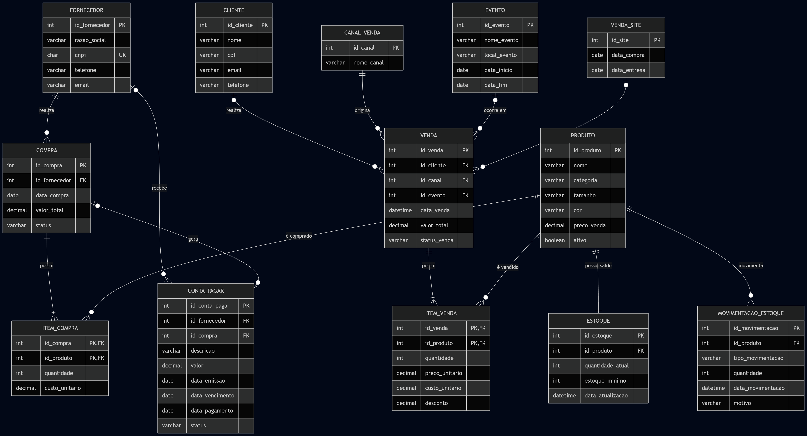

# DER — Sistema de Gestão Comercial

> Modelo de banco de dados desenvolvido para uma empresa do segmento de moda automotiva e streetwear, contemplando processos de compras, vendas, estoque e contas a pagar.


## Sobre o Projeto

Este projeto foi desenvolvido a partir da análise das principais necessidades e dificuldades enfrentadas por uma empresa do segmento de **moda automotiva e streetwear**.

Por meio de uma entrevista e de um levantamento detalhado de requisitos, investigamos os processos internos da empresa, identificando suas principais **entidades, ocorrências, relacionamentos e pontos de atenção**.

Após algumas horas de análise, concluímos que era necessário desenvolver um modelo de banco de dados capaz de organizar e integrar informações relacionadas aos processos comerciais da empresa.

## Objetivo

O objetivo deste projeto é representar, por meio de um **Diagrama Entidade-Relacionamento (DER)**, a estrutura de um banco de dados para auxiliar no controle das operações da empresa.

O modelo foi elaborado para organizar informações relacionadas a:

- Fornecedores;
- Compras;
- Produtos;
- Controle de estoque;
- Movimentações de estoque;
- Vendas;
- Clientes;
- Canais de venda;
- Eventos;
- Contas a pagar.

## Diagrama Entidade-Relacionamento

<p align="center">
  
</p>

## Entidades do Modelo

O banco de dados é composto pelas seguintes entidades:

| Entidade | Descrição |
|---|---|
| `FORNECEDOR` | Armazena os dados dos fornecedores |
| `COMPRA` | Registra as compras realizadas pela empresa |
| `ITEM_COMPRA` | Registra os produtos presentes em cada compra |
| `PRODUTO` | Armazena os produtos comercializados |
| `ESTOQUE` | Controla a quantidade disponível de cada produto |
| `MOVIMENTACAO_ESTOQUE` | Registra entradas, saídas e ajustes no estoque |
| `CLIENTE` | Armazena os dados dos clientes |
| `CANAL_VENDA` | Identifica o canal utilizado na venda |
| `VENDA_SITE` | Registra informações relacionadas às vendas realizadas pelo site |
| `EVENTO` | Armazena eventos relacionados às vendas |
| `VENDA` | Registra as vendas realizadas |
| `ITEM_VENDA` | Registra os produtos presentes em cada venda |
| `CONTA_PAGAR` | Controla os pagamentos devidos aos fornecedores |

## Principais Relacionamentos

- Um fornecedor pode realizar várias compras.
- Uma compra pode possuir vários itens.
- Um produto pode aparecer em várias compras.
- Um cliente pode realizar várias vendas.
- Uma venda pode possuir vários itens.
- Um produto pode aparecer em várias vendas.
- Um produto possui controle de estoque.
- Um produto pode possuir várias movimentações de estoque.
- Um canal de venda pode originar várias vendas.
- Um evento pode estar relacionado a várias vendas.
- Uma compra pode gerar uma ou mais contas a pagar.

## Fluxo do Sistema

### Processo de compra

1. O fornecedor é cadastrado.
2. Uma compra é registrada.
3. Os produtos são adicionados à compra.
4. O estoque é atualizado.
5. Uma conta a pagar pode ser gerada.

### Processo de venda

1. O cliente e o canal de venda são identificados.
2. A venda é registrada.
3. Os produtos são adicionados à venda.
4. O estoque é reduzido.
5. Uma movimentação de saída é registrada.

## Arquivos do Projeto

```text
DER/
├── der.mmd    # Código do diagrama em Mermaid
└── der.png    # Imagem do diagrama

README.md      # Documentação do projeto
```

## Tecnologias e Conceitos

- Modelagem de banco de dados;
- Diagrama Entidade-Relacionamento;
- Modelo relacional;
- Normalização de dados;
- Chaves primárias e estrangeiras;
- Mermaid;
- Git;
- GitHub.

## Como Visualizar o Diagrama

O diagrama pode ser visualizado diretamente neste README ou pelo arquivo:

[`DER/der.png`](DER/der.png)

O código-fonte do diagrama está disponível em:

[`DER/der.mmd`](DER/der.mmd)

O arquivo `.mmd` também pode ser editado e visualizado no [Mermaid Live Editor](https://mermaid.live/ ).

## Status do Projeto

Em desenvolvimento.

## Autor

Desenvolvido por [Larycronx](https://github.com/Larycronx ).
